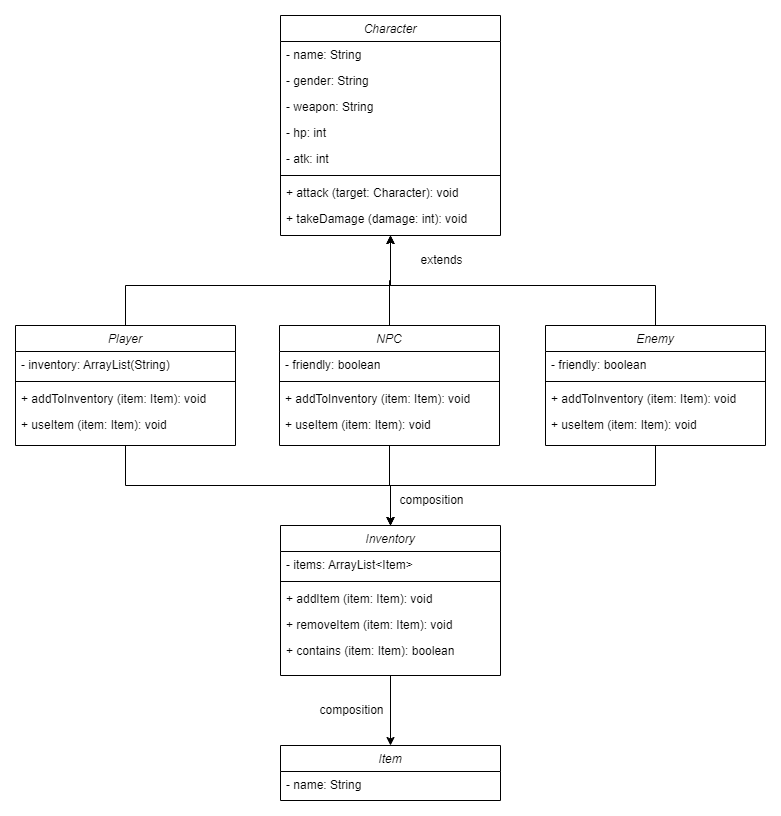
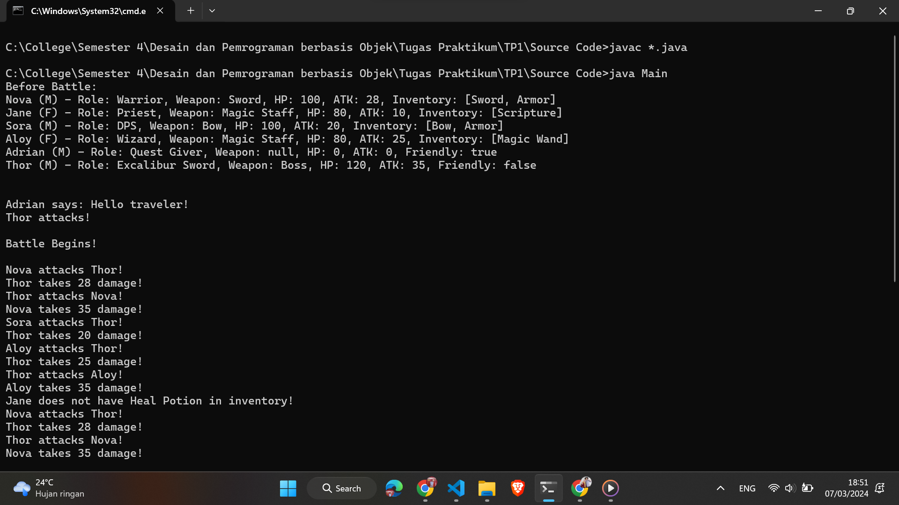
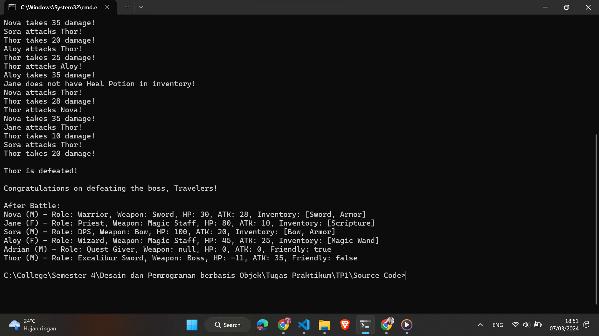

# Tugas Praktikum 1 DPBO 2024

## Janji

Saya Themy Sabri Syuhada dengan NIM 2203903.
Demi keberkahan-Nya, saya berjanji mengerjakan
tugas praktikum 1 DPBO dengan jujur dan tidak melakukan kecurangan seperti yang telah dispesifikasikan.
Aamiin.

## Desain UML

## Deskripsi dan Desain Program

Program ini adalah sistem manajemen karakter untuk sebuah permainan. Dalam permainan tersebut, pemain dapat mengendalikan karakter, berinteraksi dengan karakter non-pemain (NPC), dan bertarung melawan musuh. Setiap karakter memiliki atribut seperti nama, jenis kelamin, senjata, peran, dan statistik seperti HP (Health Points) dan ATK (Attack Points). Pemain dapat mengumpulkan dan menggunakan berbagai item yang tersedia dalam permainan.

Terdapat 6 kelas dalam program ini, yaitu:

1. **Character**

Kelas abstrak yang merupakan dasar untuk semua karakter dalam permainan. Ini mencakup atribut seperti nama, jenis kelamin, senjata, peran, HP, dan ATK. Terdapat 3 method dalam kelas ini, yaitu:

- attack(Character target): Metode untuk \* menyerang karakter target.
- takeDamage(int damage): Metode untuk mengurangi HP karakter saat menerima serangan.
- toString(): Metode untuk merepresentasikan karakter dalam bentuk string.

2. **Player**

Kelas untuk karakter pemain dalam permainan. Selain atribut yang diwarisi dari "Character", juga memiliki inventory untuk menyimpan item. Komposisi (composition) digunakan di sini dengan membuat objek "Inventory" sebagai atribut dari kelas "Player". Terdapat 2 method dalam kelas ini, yaitu:

- addToInventory(Item item): Metode untuk menambahkan item ke inventory pemain.
- useItem(Item item): Metode untuk menggunakan item dari inventory pemain.

3. **NPC**

Kelas untuk karakter non-pemain dalam permainan. Selain atribut yang diwarisi dari "Character", juga memiliki atribut friendly untuk menentukan apakah "NPC" bersahabat. Terdapat 1 method di dalam kelas ini, yaitu:

- interact(): Metode untuk berinteraksi dengan NPC, mencetak pesan berdasarkan sifat friendly.

4. **Enemy**

Kelas untuk karakter musuh dalam permainan. Ini adalah turunan dari "NPC" dengan sifat friendly yang selalu false. Terdapat 1 method di dalam kelas ini, yaitu:

- takeDamage(int damage): Metode untuk mengurangi HP musuh saat menerima serangan, mencetak pesan jika musuh dikalahkan.

5. **Inventory**

Kelas untuk menyimpan item-item dalam inventaris pemain. Menggunakan ArrayList untuk menyimpan item-item tersebut. Terdapat 3 method di dalam kelas ini, yaitu:

- addItem(Item item): Metode untuk menambahkan item ke inventaris.
- removeItem(Item item): Metode untuk menghapus item dari inventaris.
- contains(Item item): Metode untuk memeriksa apakah item tertentu ada dalam inventaris.

6. **Item**

Kelas untuk merepresentasikan item dalam permainan. Hanya memiliki satu atribut yaitu nama item. Terdapat 2 method di dalam kelas ini, yaitu:

- getName(): Metode untuk mendapatkan nama item.
- toString(): Metode untuk merepresentasikan item dalam bentuk string.

## Penjelasan Alur Program

1. Program dimulai dengan inisialisasi karakter pemain (Player) dan karakter non-pemain (NPC dan Enemy).
2. Setiap karakter diberikan atribut seperti nama, jenis kelamin, senjata, peran, HP, dan ATK.
3. Karakter pemain diberikan item-item dalam inventarisnya menggunakan metode addToInventory.
4. Karakter pemain dapat menggunakan item dari inventarisnya menggunakan metode useItem.
5. Pemain dapat menyerang karakter lain menggunakan metode attack.
6. Karakter non-pemain dapat berinteraksi dengan pemain, misalnya memberikan misi atau bertarung.
7. Program menampilkan pesan berdasarkan aksi yang dilakukan oleh pemain dan karakter lainnya.

## Screenshots

